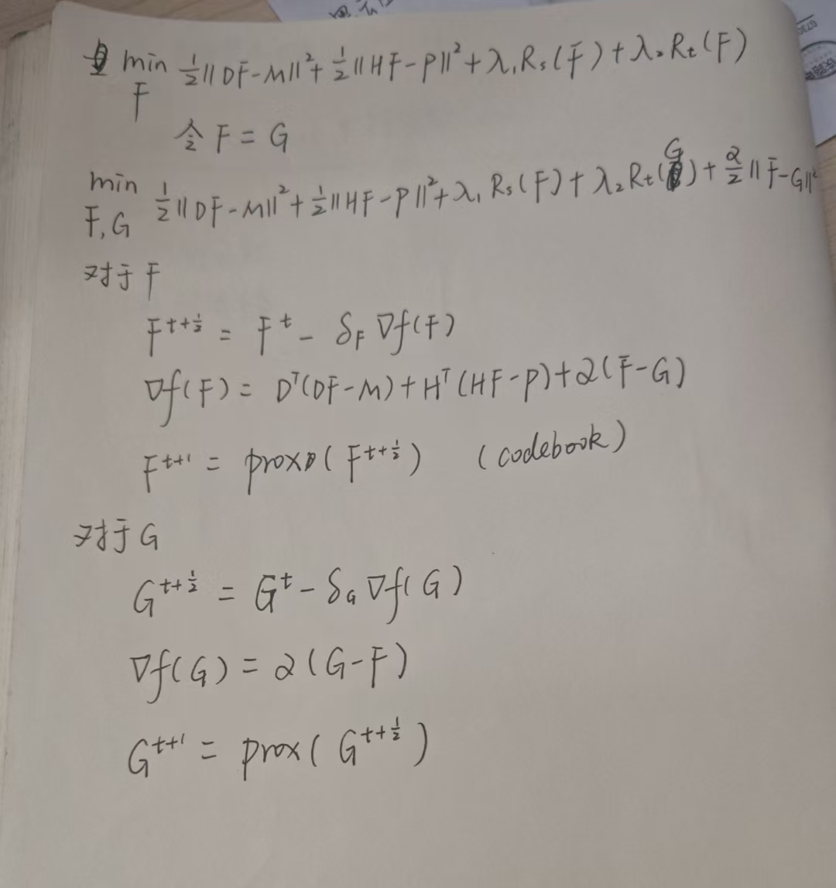

# Unified Pansharpening

### 代码说明

* 本代码`fork`自[DURE-Net](https://github.com/TingMAC/DURE-Net) ，绝大部分的深度展开框架的代码都来自于这个仓库，但是也是可以用的。
* 深度展开框架中涉及到了两个ProxNet，一个是用了PromptIR，是对于每张图像的特有的先验；另一个则是用了codebook，是对于数据集自身的先验。
* PromptIR的代码大部分来自[PromptIR](https://github.com/va1shn9v/PromptIR/blob/main/net/model.py)，由于源代码有很多耦合度太高的地方，所以做了一点修改。
  * 对应的代码在`PromptIR/Model_AMIR.py`中的*ProxNet_Prompt*类
* Codebook中`codebook/model/model3D`目录下的代码以及`codebook/model/vq3D.py`都是改成3D的代码，可以用来参考，其中`codebook/model/model3D/MSAB3D.py`中涉及到一些注意力的代码改成3D的，会比较麻烦，可以参考借鉴。

#### SpatialPrompt和SpectralPrompt

模型的核心代码在`PromptIR/SpatialChannelPrompt.py`下。

训练代码`train_pansharpeningNotext.py`，需要设置的参数，一般就是批量大小4/8或者更多，`pan_root`是数据集路径，`save_dir`是日志保存路径，`gpu_id`是对应的显卡下标，`exp_name`是这个实验的名字。

```python
def get_opt():
    parser = argparse.ArgumentParser(description='Hyper-parameters for network')
    parser.add_argument('--exp_name', type=str, default='Compared:PromptIRContinue', help='experiment name')
    parser.add_argument('-learning_rate', help='Set the learning rate', default=2e-4, type=float)
    parser.add_argument('-batch_size', help='批量大小', default=1, type=int)
    parser.add_argument('-epoch_start', help='Starting epoch number of the training', default=0, type=int)
    parser.add_argument('-num_epochs', help='', default=400, type=int)
    parser.add_argument('-pan_root', help='数据集路径', default='/data/datasets/pansharpening/NBU_dataset0730', type=str)
    parser.add_argument('-save_dir', help='日志保存路径', default='/data/cjj/projects/UnifiedPansharpening/experiment', type=str)
    parser.add_argument('-gpu_id', help='gpu下标', default=0, type=int)
    parser.add_argument('-Ch', help='', default=8, type=int)
    parser.add_argument('-Stage', help='', default=4, type=int)
    parser.add_argument('-nc', help='', default=32, type=int)
    parser.add_argument('-total_iteration', help='', default=2e5, type=int)
    
    args = parser.parse_args()
    
    return args
```

同时记得修改系统路径：

```python
import sys
sys.path.append("/data/cjj/projects/UnifiedPansharpening") # 此处填写你的项目路径
```

如果出现导包问题，也是因为一些模型文件的这个路径需要修改。

#### Dataset

`Dataset.py`中的`MatWithTextDataset`是加载遥感图像数据集和文本`Caption`数据集的代码。

### 深度展开框架

* `Model.py`是中的`DURE`是2D深度展开框架的代码。

* `Model2D_3D.py`中的`DURE2D_3D`是既有2D又有3D的框架的代码，除了codebook是3D的，其他的部分全都是2D的。

> 因为发现纯3D框架效果比较差，所以看一下把除codebook外的代码都改成2D看看是什么效果/

* `Model3D.py`中的`DURE3D`是3D深度展开框架的代码。

* `Model3Dwith2D.py`是在ProxNet中将3D特征处理成2D特征后进行处理，但后续发现效果不是很好。

#### ProxNet

* PromptIR，参考论文：[PromptIR: Prompting for All-in-One Blind Image Restoration](https://arxiv.org/abs/2306.13090)
  * 纯正的2DpromptIR:`PromptIR/Model_AMIR.py`中的`ProxNet_Prompt`
  * 3DpromptIR:`PromptIR/PromptIR3D.py`
* WavBest，代码:`WavBEST/WavBEST.py`，是对比方法`TMdiff`中涉及到的U-Net
* AdaIR，代码:`AdaIR/AdaIR.py`，参考论文：[ADAIR: ADAPTIVE ALL-IN-ONE IMAGE RESTORATION VIA FREQUENCY MINING AND MODULATION](https://arxiv.org/abs/2403.14614)，目前效果很好。

### 训练

`train_codebook.py`是训练`codebook`的代码。

`train_pansharpening.py`是训练深度展开框架的代码。

### 自适应卷积

代码：`channel_Adapt/DynamicChannelAdaptation.py`

在代码`Model2D_3D.py`中的`DURE2D_3DWithAdaptiveConv`中使用到了自适应卷积，效果目前来看差不太多。

参考论文：[FlexiMo: A Flexible Remote Sensing Foundation Model](https://arxiv.org/abs/2503.23844)

### 理论



$F$是HRMS，$D$是模糊核，$M$是LRMS。$H$是光谱变换(也许)，$P$是PAN图像。

其中$R_s$和$R_t$就是分别指的对于数据集的先验和对于每个图像的先验。